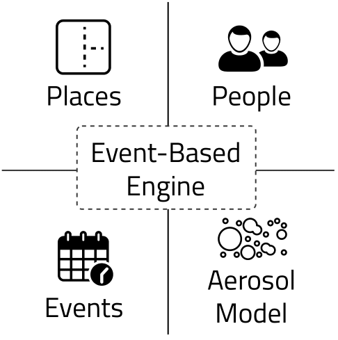

Framework
=========

Engine
------

**archABM** is an event-based multi-agent simulation framework designed to simulate *complex human interaction* patterns with and within the built environment and to calculate indoor air quality metrics and physiological responses.

**archABM** is implemented using `Python 3.7.9 <https://www.python.org/downloads/release/python-379/>`_ , and adopts an object-oriented paradigm, where each agent is a class instance. The simulation engine is developed on top of the `SimPy 4.0.1 <https://gitlab.com/team-simpy/simpy>`_ library, a process-based discrete-event simulation framework. Under this paradigm, *processes* are used to model the behavior of active components, such as users. 

Processes live in an *environment* and interact with the environment and with each other via *events*. The most important event type for our application is the *timeout*, which allows a process to sleep for the given time, determining the duration of the activity.

.. important::
    Agent-based simulators can be implemented in two ways: a) **continuous** simulation and b) **event-based** simulation. 
    An event-based approach is followed for **archABM**.

    * **Continuous** simulations have a fixed time-step, and the system state is updated in every step. It is critical to select an appropriate period parameter, which indicates how much time elapses between state updates. 
    * In **discrete event-based** simulations, the system is only updated when a new event occurs. The simulator processes new events in sequential order as they are fired or triggered by the simulated entities or agents.

Components
----------

The simulator's core is composed of a discrete event-based engine that manages every activity carried out by the agents during their life-cycle using a priority event queue, ordered by time. The event-based engine is at the core of the simulator and is fed by events produced by the agents.

During the simulation execution, events are handled sequentially, in chronological order. Whenever any agent does an action or takes a decision, it generates and inserts new events into the priority queue. As actions and activities occur, each event is registered on the simulation history to be further exploited for visualization and data analysis purposes. 

The workflow of the simulator is described as follows: first, Simpy's environment is created, and the provided configuration data is used to generate *events*, *places*, and *people*, as well as to initialize the *aerosol model*. People are introduced into the environment at the start of the day, and their goal is to complete events until the end of the day arrives.

Events
^^^^^^

An **event** is an activity that takes place at a specific physical location for a finite time. Event models (for example: work, meeting, coffee, lunch, etc.) are restricted to a *schedule*, a set *duration*, and a number of *repetitions*. The schedule specifies the times when an activity is permitted to take place. Lower and upper bounds apply to both the duration :math:`\tau` and the number of repetitions. Concerning the aerosol model, the *mask efficiency* is also indicated for each activity. Activities invoked by an individual but involving many people, such as meetings, can also be defined. These are called *collective* events.

.. image:: _static/schedule.png
    :align: center
    :width: 500

Event selection
"""""""""""""""

The event generation process selects the next activity based on the priority values of each event model. Priority values are used to weigh the importance of each event model rather than sampling from a uniform discrete distribution. The *priority* value is determined by a piecewise linear function, which is parametrized by the a) minimum number of repetitions ``r``, b) maximum number of repetitions ``R``, and c) the event repetition count ``e``.

.. math::
    Priority(e) = 
    \left\{\begin{matrix}
    1-(1-\alpha)\cfrac{e}{r}\,,\quad 0 \leq  e < r \\
    \alpha\cfrac{R-e}{R-r}\,,\quad r \leq  e < R 
    \end{matrix}\right.

.. tikz:: Priority piecewise linear function
    \pgfmathsetmacro{\N}{10};
    \pgfmathsetmacro{\M}{6};
    \pgfmathsetmacro{\NN}{\N-1};
    \pgfmathsetmacro{\MM}{\M-1};
    \pgfmathsetmacro{\repmin}{2.25};
    \pgfmathsetmacro{\repmax}{8.5};
    \pgfmathsetmacro{\a}{2};
    \coordinate (A) at (0,\MM);
    \coordinate (B) at (\NN,0);
    \coordinate (C) at (\repmin, \a);
    \coordinate (D) at (\repmax, 0);
    \coordinate (E) at (\repmin, 0);
    \coordinate (F) at (0, \a);
    \draw[stepx=1,thin, black!20] (0,0) grid (\N,\M);
    \draw[->, very thick] (0,0) to (\N,0) node[right] {Event count};
    \draw[->, very thick] (0,0) to (0,\M)  node[above] {Priority};
    \draw (0.1,0) -- (-0.1, 0) node[anchor=east] {0};
    \draw (0, 0.1) -- (0, -0.1);
    \draw (\repmin,0.1) -- (\repmin,-0.1) node[anchor=north] {$repeat_{min}$};
    \draw (\repmax,0.1) -- (\repmax,-0.1) node[anchor=north] {$repeat_{max}$};
    \draw[ultra thick] (0.1, \MM) -- (-0.1, \MM) node[left] {1};
    \draw[very thick, black!50, dashed] (C) -- (F) node[left] {$\alpha$};
    \draw[very thick, black!50, dashed] (C) -- (E);
    \draw[ultra thick, red] (A) -- (C);
    \draw[ultra thick, red] (C) -- (D);
    :xscale: 70
    :align: center

Following the selection of the event model, the duration and physical location of the event can be determined. Next, the selected activity is counted (consumed) from the invoking person's list of events. Collective activities are consumed individually after the current event interruption. Finally, based on the generated event, the person is moved from the current location to the new location and remains there for a specified time. Once the activity is fulfilled, the event generator produces a new event. If a person is interrupted while performing his current task, the assigned event becomes the new current. 

Places
^^^^^^

A **place** is an enclosed section of a building designed for specific activities and is defined by the following parameters: building, departments allowed to enter, area and height (or volume), capacity :math:`N`, and passive :math:`\lambda_a` and active :math:`\lambda_r` ventilation. 

People
^^^^^^

Regarding the **people** dimension, specific departments or groups need to be defined, each one associated with a building and some people. 

Aerosol Model
^^^^^^^^^^^^^

The **aerosol model** estimates the indoor aerosolized virus quanta concentration, based on adjustable parameters such as room size, number of exposed subjects, inhalation volume, and aerosol production from breathing and vocalization, among others. The model developed by Peng et al. at the University of Colorado, :cite:`doi:10.1021/acs.estlett.1c00183,https://doi.org/10.1111/ina.12751,Peng2021.04.21.21255898`., calculates both the virus quanta concentration and the CO\ :sub:`2` mixing ratio present in a specific place. These two metrics provide an overall picture of indoor air quality, which is why this model was selected for ArchABM. The model combines two submodels: 

#. A **standard atmospheric box model**, which assumes that the emissions are completely mixed across a control volume quickly (such as an indoor room or other space). See for example Chapter 3 of the Jacob Atmos. Chem. textbook :cite:`10.2307/j.ctt7t8hg`, and Chapter 21 of the Cooper and Alley Air Pollution Control Engineering Textbook :cite:`cooper2010air` for indoor applications. This is an approximation that allows easy calculation, is approximately correct as long as near-field effects are avoided by social distancing, and is commonly used in air quality modeling.

#. A **standard aerosol infection model** (Wells-Riley model), as formulated in Miller et al. 2020 :cite:`https://doi.org/10.1111/ina.12751`, and references therein :cite:`10.1093/oxfordjournals.aje.a112560,BUONANNO2020105794,BUONANNO2020106112`.		

.. important::
    The propagation of COVID-19 is only by aerosol transmission. 

    The model is based on a standard model of aerosol disease transmission, the Wells-Riley model. 
    It is calibrated to COVID-19 per recent literature on quanta emission rate.

    This is not an epidemiological model, and does not include droplet or contact / fomite transmission, and assumes that 6 ft / 2 m social distancing is respected. Otherwise higher transmission will result.

Performance
-----------

In order to analyze **archABM**'s computational performance, several simulations were computed with a different number of people and places. A grid of values for the number of people *{6, 30, 60, 120, 300, 600, 1200, 2400}* and the number of places *{15, 20, 25, 30, 35}* was established. The computational time required to compute 24h of simulated time is measured. In order to yield stable results, the simulations are repeated 20 times. 

.. image:: _static/figures/performance.png
    :align: center
    :width: 500

The number of people is indeed the most influential parameter concerning the simulator's performance. Using the number of people as the predictor, the univariate linear regression model applied to the response variable time yields a slope parameter of 2.4 10\ :sup:`-3` seconds per person. Thus, on average, **archABM** is able to run 24h of simulated time with 1000 people and 20 places in approximately 2.4 seconds. 