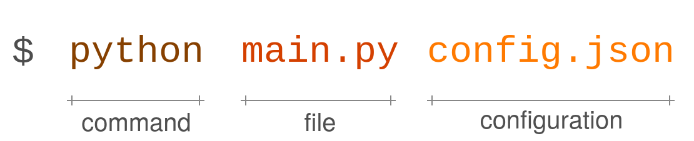

.. archABM documentation master file, created by
   sphinx-quickstart on Mon Jun 28 18:23:50 2021.
   You can adapt this file completely to your liking, but it should at least
   contain the root `toctree` directive.

.. figure:: _static/logo_4.png
   :width: 400
   :align: center

   Agent-based model simulation for air quality and pandemic risk assessment in architectural spaces.

.. image:: https://img.shields.io/pypi/status/archABM?style=flat-square
    :target: https://pypi.python.org/pypi/archABM
    :alt: PyPI Status

.. image:: https://img.shields.io/pypi/v/archABM?style=flat-square
    :target: https://pypi.python.org/pypi/archABM
    :alt: PyPI Version

.. image:: https://img.shields.io/github/license/Vicomtech/ArchABM?style=flat-square
    :target: https://github.com/Vicomtech/ArchABM/blob/master/LICENSE
    :alt: License

.. image:: https://img.shields.io/github/workflow/status/Vicomtech/ArchABM/Build%20&%20publish%20to%20Pypi?style=flat-square
    :target: https://github.com/Vicomtech/ArchABM/actions
    :alt: Actions

.. image:: https://img.shields.io/pypi/dm/archABM?style=flat-square
    :target: https://pepy.tech/project/archABM

.. image:: https://img.shields.io/github/languages/top/Vicomtech/ArchABM?style=flat-square
    :target: https://github.com/Vicomtech/ArchABM
    :alt: Top Language

.. image:: https://img.shields.io/github/issues/Vicomtech/ArchABM?style=flat-square
    :target: https://github.com/Vicomtech/ArchABM
    :alt: Github Issues

----

.. _quick-start guide:

User Guide
==========

**archABM** is a fast and open source agent-based modelling framework that simulates complex human-building-interaction patterns and estimates indoor air quality across an entire building, while taking into account potential airborne virus concentrations.

This documentation contains a `quick-start guide`_ (including
`installation`_ procedure and
`basic usage`_ of the simulator),
a complete :ref:`API Reference<API>`, as well as a detailed :ref:`example<example>`.
**archABM** is released under the MIT License. 

Finally, if you use **archABM** in a scientific publication, we would appreciate :ref:`citations<citing>`. 

----

.. admonition:: Disclaimer
  :class: caution

  archABM is an evolving research tool designed to familiarize the interested user with factors influencing the potential indoor airborne transmission of viruses (such as SARS-CoV-2) and the generation of carbon-dioxide (CO2) indoors. 
  Calculations of virus and CO2 levels within ArchABM are based on recently published aerosol models [1,2], which however have not been validated in the context of agent-based modeling (ABM) yet. We note that uncertainty in and intrinsic variability of model parameters as well as underlying assumptions concerning model parameters may lead to errors regarding the simulated results.
  Use of archABM is the sole responsibility of the user. It is being made available without guarantee or warranty of any kind. The authors do not accept any liability from its use.

  [1] *Peng, Zhe, and Jose L. Jimenez. "Exhaled CO2 as a COVID-19 infection risk proxy for different indoor environments and activities." Environmental Science & Technology Letters 8.5 (2021): 392-397.*
  
  [2] *Lelieveld, Jos, et al. "Model calculations of aerosol transmission and infection risk of COVID-19 in indoor environments." International journal of environmental research and public health 17.21 (2020): 8114.*

----

.. _basic usage:

Getting Started
---------------

Use the following template to run a simulation with archABM:

.. code-block:: python

    # Import modules
    import json
    import pandas as pd
    from archABM.engine import Engine

    # Read configuration example
    from archABM.config import config
    # Alternatively, get configuration from "config.json" example

    # Create ArchABM simulation engine
    simulation = Engine(config)

    # Run simulation
    results = simulation.run()

    # Create dataframes based on the results
    df_people = pd.DataFrame(results["results"]["people"])
    df_places = pd.DataFrame(results["results"]["places"])

This example uses the default configuration file built-in the library.
Alternatively, you can download and modify the :download:`config.json <../../data/config.json>` file found at the ``data`` directory of **archABM** repository.

----

Developers can also use the command-line interface with the `main.py <https://github.com/Vicomtech/ArchABM>`_ file from the source code repository.

.. code-block:: shell-session

   $ python main.py config.json

To run an example, use the :download:`config.json <../../data/config.json>` found at the ``data`` directory of **archABM** repository.

Check the ``--help`` option to get more information about the optional parameters:

.. program-output:: python main.py --help
    :prompt: 
    :cwd: ../../

----

Inputs
^^^^^^

In order to run a simulation, information about the ``event`` types, ``people``, ``places``, and the ``aerosol model`` must be provided to the ArchABM framework.

.. tabs::

    .. tab:: Events

        .. list-table:: 
            :header-rows: 1

            * - Attribute
              - Description
              - Type
            * - *name*
              - Event name
              - :obj:`string`
            * - *schedule*
              - When an event is permitted to happen, in minutes
              - :obj:`list of tuples`
            * - *duration*
              - Event duration lower and upper bounds, in minutes
              - :obj:`integer,integer`
            * - *number of repetitions*
              - Number of repetitions lower and upper bounds
              - :obj:`integer,integer`
            * - *mask efficiency*
              - Mask efficiency during an event [0-1]
              - :obj:`float`
            * - *collective*
              - Event is invoked by one person but involves many
              - :obj:`boolean`
            * - *allow*
              - Whether such event is allowed in the simulation
              - :obj:`boolean`
        
   
    .. tab:: Places

        .. list-table:: 
            :header-rows: 1

            * - Attribute
              - Description
              - Type
            * - *name*
              - Place name
              - :obj:`string`
            * - *activity*
              - Activity or event occurring at that place 
              - :obj:`string`
            * - *department*
              - Department name
              - :obj:`string`
            * - *building*
              - Building name
              - :obj:`string`
            * - *area*
              - Room floor area in square meters
              - :obj:`float`
            * - *height*
              - Room height in meters.
              - :obj:`float`
            * - *capacity*
              - Room people capacity.
              - :obj:`integer`
            * - *height*
              - Room height in meters.
              - :obj:`float`
            * - *ventilation*
              - Passive ventilation in hours\ :sup:`-1`
              - :obj:`float`
            * - *recirculated_flow_rate*
              - Active ventilation in cubic meters per hour
              - :obj:`float`
            * - *allow*
              - Whether such place is allowed in the simulation
              - :obj:`boolean`
        
    .. tab:: People

        .. list-table:: 
            :header-rows: 1

            * - Attribute
              - Description
              - Type
            * - *department*
              - Department name
              - :obj:`string`
            * - *building*
              - Building name
              - :obj:`string`
            * - *num_people*
              - Number of people
              - :obj:`integer`

    .. tab:: Aerosol Model

        .. list-table:: 
            :header-rows: 1

            * - Attribute
              - Description
              - Type
            * - *pressure*
              - Ambient pressure in atm
              - :obj:`float`
            * - *temperature*
              - Ambient temperature in Celsius degrees
              - :obj:`float`
            * - *CO2_background*
              - Background CO\ :sub:`2` concentration in ppm
              - :obj:`float`
            * - *decay_rate*
              - Decay rate of virus in hours\ :sup:`-1`
              - :obj:`float`
            * - *deposition_rate*
              - Deposition to surfaces in hours\ :sup:`-1`
              - :obj:`float`
            * - *hepa_flow_rate*
              - Hepa filter flow rate in cubic meters per hour
              - :obj:`float`
            * - *filter_efficiency*
              - Air conditioning filter efficiency
              - :obj:`float`
            * - *ducts_removal*
              - Air ducts removal loss
              - :obj:`float`
            * - *other_removal*
              - Extraordinary air removal
              - :obj:`float`
            * - *fraction_immune*
              - Fraction of people immune to the virus
              - :obj:`float`
            * - *breathing_rate*
              - Mean breathing flow rate in cubic meters per hour
              - :obj:`float`
            * - *CO2_emission_person*
              - CO\ :sub:`2` emission rate at 273K and 1atm
              - :obj:`float`
            * - *quanta_exhalation*
              - Quanta exhalation rate in quanta per hour
              - :obj:`float`
            * - *quanta_enhancement*
              - Quanta enhancement due to variants
              - :obj:`float`
            * - *people_with_masks*
              - Fraction of people using mask
              - :obj:`float`

 

    .. tab:: Options

        .. list-table:: 
            :header-rows: 1

            * - Attribute
              - Description
              - Type
            * - *movement_buildings*
              - Allow people enter to other buildings 
              - :obj:`boolean`
            * - *movement_department*
              - Allow people enter to other departments
              - :obj:`boolean`
            * - *number_runs*
              - Number of simulations runs to execute
              - :obj:`integer`
            * - *save_log*
              - Save events logs
              - :obj:`boolean`
            * - *save_config*
              - Save configuration file
              - :obj:`boolean`
            * - *save_csv*
              - Export the results to csv format
              - :obj:`boolean`
            * - *save_json*
              - Export the results to json format
              - :obj:`boolean`
            * - *return_output*
              - Return a dictionary with the results
              - :obj:`boolean`
            * - *directory*
              - Directory name to save results
              - :obj:`string`
            * - *ratio_infected*
              - Ratio of infected to total number of people
              - :obj:`float`
            * - *model*
              - Aerosol model to be used in the simulation
              - :obj:`string`

.. raw:: html

    

    
<a>Example config.json</a>

.. literalinclude:: ../../data/config_basic.json
    :language: JSON

.. raw:: html
    
    

----

Outputs
^^^^^^^

Simulation outputs are stored by default in the ``results`` directory. The subfolder with the results of an specific simulation have the date and time of the moment when it was launched as a name in ``%Y-%m-%d_%H-%M-%S-%f`` format.

By default, three files are saved after a simulation: 

* ``config.json`` stores a copy of the input configuration.
* ``people.csv`` stores every person's state along time.
* ``places.csv`` stores every places's state along time.

.. tabs::
    .. tab:: people.csv
    
        .. list-table:: 
            :header-rows: 1

            * - Attribute
              - Description
              - Type
            * - *run*
              - Simulation run
              - :obj:`int`
            * - *time*
              - Simulation time (minutes)
              - :obj:`int`
            * - *person*
              - Person ID
              - :obj:`int`
            * - *status*
              - Person status (0: susceptible, 1: infective)
              - :obj:`bool`
            * - *place*
              -  Place ID
              - :obj:`int`
            * - *event*
              - Event ID
              - :obj:`int`
            * - *CO2_level*
              - Average CO\ :sub:`2` level (ppm)
              - :obj:`float`
            * - *quanta_inhaled*
              - Quanta inhaled (quanta)
              - :obj:`float`

    .. tab:: places.csv

        .. list-table:: 
            :header-rows: 1

            * - Attribute
              - Description
              - Type
            * - *run*
              - Simulation run
              - :obj:`int`
            * - *time*
              - Simulation time (minutes)
              - :obj:`int`
            * - *place*
              -  Place ID
              - :obj:`int`
            * - *num_people*
              - Number of people
              - :obj:`int`
            * - *infective_people*
              - Number of infective people
              - :obj:`int`
            * - *CO2_level*
              - CO\ :sub:`2` level (ppm)
              - :obj:`float`
            * - *quanta_level*
              - quanta level (ppm)
              - :obj:`float`

**archABM** offers the possibility of exporting the results in *JSON* and *CSV* format. To export in *JSON* format, use the ``--save-json`` parameter when running archABM. By default, the ``--save-csv`` parameter is set to `true`.

Alternatively, **archABM** can also be configured to yield more detailed information. The ``app.log`` file saves the log of the actions and events occurred during the simulation. To export this file, use the ``--save-log`` parameter when running archABM.

----

Installation
------------

As the compiled **archABM** package is hosted on the Python Package Index (PyPI) you can easily install it with ``pip``.
To install **archABM**, run this command in your terminal of choice:

.. code-block:: shell-session

    $ pip install archABM

or, alternatively:

.. code-block:: shell-session

    $ python -m pip install archABM

If you want to get **archABM**'s latest version, you can refer to the
repository hosted at github:

.. code-block:: shell-session

    python -m pip install https://github.com/Vicomtech/ArchABM/archive/main.zip

----

Environment Setup
-----------------

Requirements
^^^^^^^^^^^^

**archABM** builds on ``simpy``, ``tqdm``, ``jsonschema`` and ``typer`` libraries.

Python 3
^^^^^^^^

To find out which version of ``python`` you have, open a terminal window and try the following command:

.. code-block:: shell-session

    $ python3 --version
    Python 3.6.9

If you have ``python3`` on your machine, then this command should respond with a version number. If you do not have ``python3`` installed, follow these `instructions <https://realpython.com/installing-python>`_.

Pip
^^^

``pip`` is the reference Python package manager. It’s used to install and update packages. In case ``pip`` is not installed in your OS, follow these `instructions <https://pip.pypa.io/en/stable/installation/>`_.

Virtual Environment
^^^^^^^^^^^^^^^^^^^

``venv`` creates a “virtual” isolated Python installation and installs packages into that virtual installation. It is always recommended to use a virtual environment while developing Python applications. To create a virtual environment, go to your project’s directory and run venv.

.. code-block:: shell-session

    $ python3 -m venv env

Before you can start installing or using packages in your virtual environment you’ll need to activate it. 

.. code-block:: shell-session

    $ source env/bin/activate

----

Source Code
-----------

archABM is developed on GitHub, where the code is
`always available <https://github.com/Vicomtech/ArchABM>`_.

You can either clone the public repository:

.. code-block:: shell-session

    $ git clone git://github.com/Vicomtech/ArchABM.git

Or, download the `tarball <https://github.com/Vicomtech/ArchABM/tarball/main>`_:

.. code-block:: shell-session

    $ curl -OL https://github.com/Vicomtech/ArchABM/tarball/main
    # optionally, zipball is also available (for Windows users).

Once you have a copy of the source, you can embed it in your own Python
package, or install it into your site-packages easily:

.. code-block:: shell-session

    $ cd ArchABM
    $ python -m pip install .
